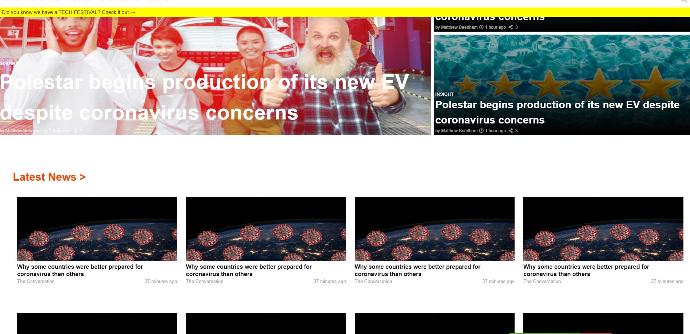

# Responsive Design Project

> This is an assigment for Microverse HTML and CSS course. The goal is to cloen the TNW design web site with responsive properties.

Additional description about the project and its features.

## Built With

- HTML,
- CSS,
- Visual Studio Code
- Linter
- W3C HTML Validator

## Live Demo

[Live Demo](https://raw.githack.com/fdfragoso/responsive-design-tnw/features/index.html)

## Getting Started

To get a local copy up and running follow these simple example steps.

### Prerequisites

- A compatible browser with HTML and CSS. 

### Install

- Just clone the project

### Usage

- Open the index.html file in any browser or edit using Visual Code or the preference IDE for web development

## Authors

👤 **Felipe Dacal Fragoso**

- Github: [@fdfragoso](https://github.com/fdfragoso)
- Twitter: [@fdfragoso](https://twitter.com/fdfragoso)
- Linkedin: [@fdfragoso](https://www.linkedin.com/in/fdfragoso/)

👤 **Jelil Faisal Abudu**

- Github: [@JelilFaisalAbudu](https://github.com/JelilFaisalAbudu)
- Twitter: [@jelilabudu](https://twitter.com/jelilabudu)
- Linkedin: [@jelilfaisalabudu](www.linkedin.com/in/jelilfaisalabudu)

## 🤝 Contributing

Contributions, issues and feature requests are welcome!

Feel free to check the [issues page](https://github.com/JelilFaisalAbudu/teardown/issues).

## Show your support

Give a ⭐️ if you like this project!

## Acknowledgments

- The Odin Project
- The New Web

## 📝 License

This project is free to use as learning purposes. For any external content (e.g. logo, images, ...), please contact the proper author and check their license of use.
